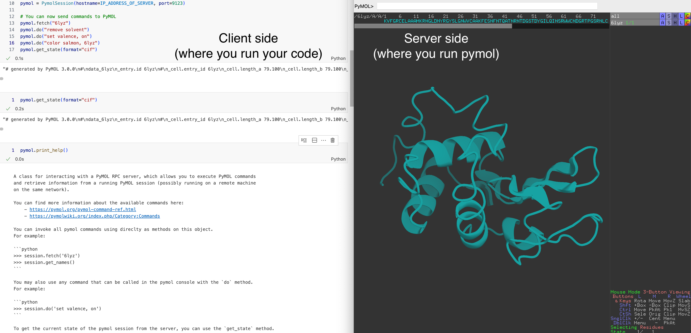

[](https://github.com/astral-sh/ruff)
[](https://pypi.org/project/pymol-remote/)
[](https://github.com/Croydon-Brixton/pymol-remote)

# PyMOL Remote
> A simple RPC client for sending commands and data between Python and PyMOL.
(RPC = Remote Procedure Call)

First things first, some definitions:
- **server** is the machine where PyMOL is running with the graphical interface, for example your laptop.
- **client** is the machine where you want to run your Python code and that you want to send commands to PyMOL from.



## 1. Installation
`pymol-remote` has no dependencies beyond the base Python standard library, so installation is straightforward:
```bash
pip install pymol-remote
```

First things first, some definitions:
- **server** is the machine where PyMOL is running with the graphical interface, for example your laptop.
- **client** is the machine where you want to run your Python code and that you want to send commands to PyMOL from.

On the server side, you need to have a working `pymol` installation. Whichever python interpreter you are using to run `pymol` should also have `pymol-remote` installed (or needs to have `pymol-remote` in its pythonpath). The easiest way to do this is to [install `pymol` via `conda`](https://pymol.org/conda/) into an existing or new environment and then install `pymol-remote` in the same environment with `pip install pymol-remote`.

On the client side, you need to have a working Python environment with `pymol-remote` installed.

## 2. Usage
First things first, some definitions:
- `server` is the machine where PyMOL is running with the graphical interface, for example your laptop.
- `client` is the machine where you want to run your Python code and that you want to send commands to PyMOL from.

### 2.1 Local usage (server & client on the same machine)
First, start PyMOL with the RPC server by using the `pymol_remote` command. `pymol_remote` will need to find your `pymol` executable in your environment, so make sure you are in an environment that has both `pymol` and `pymol_remote` installed or that you have `pymol` in your pythonpath such that `pymol_remote` can find it.
```bash
# In your terminal, navigate into an environment that has both pymol and pymol_remote installed
# e.g.: conda activate pymol

# Start PyMOL with the RPC server (by default it will listen on port 9123)
pymol_remote
# to specify a different port, use the PYMOL_RPC_PORT environment variable:
# e.g.: PYMOL_RPC_PORT=9124 pymol_remote
```

If successful, you should have seen a PyMOL window open with the PyMOL console.
You can now send commands back and forth between your Python code and PyMOL.

In your Python code, you can now connect to the local PyMOL instance and send commands to it.
```python
from pymol_remote.client import PymolSession

# Connect to the local PyMOL instance
pymol = PymolSession(hostname="localhost", port=9123)

# You can now send commands to PyMOL
pymol.fetch("6lyz")
pymol.do("remove solvent")
pymol.do("set valence, on")
pymol.get_state(format="cif")

# To see all available methods use
pymol.help()

# To get more help on a specific method, use
pymol.help("fetch")

# To get more general documentation information, use
pymol.print_help()
```

### 2.2 Remote usage via port forwarding (server & client on different machines)
Beyond version `v0.1.0`, `pymol_remote` automatically starts PyMOL with `localhost` as the host for security reasons.
To connect remotely, use SSH port forwarding:

1. **Server side (where PyMOL is running)**
```bash
# Start PyMOL with the RPC server as explained in 2.1.
# By default, it will listen on localhost:9123
pymol_remote
```

2. **Client side (on your remote machine)**
Connect to the machine (e.g. a cloud server, your HPC, etc.) where you want to run your Python code via SSH and set up port forwarding.
You will need to use the same port number as the one you used when starting PyMOL on the server side, by default 9123.
```bash
# Set up SSH port forwarding (run this in a terminal)
ssh -R 9123:localhost:9123 username@server_address
```

When you are connected to the server, you can now run your Python code and send commands to PyMOL.
```python
from pymol_remote.client import PymolSession

# Connect to the PyMOL instance running on the server
pymol = PymolSession(hostname="localhost", port=9123)

# You can now send commands to PyMOL running on the server
pymol.fetch("6lyz")
pymol.do("remove solvent")
...
```

The SSH port forwarding (`-R`) creates a secure tunnel between your client and server machines, allowing you to safely connect to PyMOL running on the remote server. This is the recommended approach for remote connections as it's both secure and doesn't require exposing PyMOL to the network, which is harder to set up securely.
For more details on how to use this option, see [Martin Buttenschön's short blog post](https://www.blopig.com/blog/2024/11/controlling-pymol-from-afar/) on controlling PyMOL from afar.****

### 2.3 Remote usage via network (⚠️ NOT RECOMMENDED ⚠️)
In versions v0.1.0 and below, the `pymol_remote` command will automatically start pymol and listen on all interfaces. This can be a security risk and potentially expose your PyMOL session to the public internet if you are not configuring the network and firewall properly and has therefore been removed as default in versions above v0.1.0.

If you know what you are doing (e.g. if you are running this on a private network and have configured the network and firewall properly), you can still use the old behaviour by starting pymol to listen on all interfaces as described below.

**Server side (where PyMOL is running)**
```bash
# Navigate into an environment that has both, pymol and pymol_remote installed
# e.g.: conda activate pymol

# If pymol_remote is installed, the following command will start the server
#  and listen on all interfaces (0.0.0.0) and port 9123 by default:
PYMOL_RPC_HOST=0.0.0.0 pymol_remote
```
This command will start pymol, and in the pymol console you should see a likely guess of your IP address (and the correct port number, 9123 by default).
If this IP address does not work, you might need to use commands like `ifconfig` or `ipconfig` on your computer to find the correct IP address of the server in your local network.

**Client side (where you want to run your Python code)**
Make sure you have the `pymol_remote` package installed in the Python environment where you want to run your code.
Make sure you ran `pymol_remote` on the server side before running the Python code below.

```python
from pymol_remote.client import PymolSession

# NOTE: When you run `pymol_remote` on the server side, it will print a likely guess of your 
#  IP address (and the correct port number, 9123 by default). Try that IP address first,
#  if it doesn't work you might need to use commands like `ifconfig` or `ipconfig` on
#  your computer to find the correct IP address of the server in your local network.
pymol = PymolSession(hostname="ip_address_of_server", port=9123)
 
# You can now send commands to PyMOL
pymol.fetch("6lyz")
pymol.do("remove solvent")
...
```

## 3. Credit
This implementation is inspired by and based on the original [RDKit RPC](https://github.com/rdkit/rdkit/blob/master/rdkit/python/rdkit/Chem/PyMol.py) implementation and [PyMOL RPC](https://github.com/schrodinger/pymol-open-source/blob/9d3061ca58d8b69d7dad74a68fc13fe81af0ff8e/modules/pymol/rpc.py) by Greg Landrum. Thank you Greg! And thank you Schrodinger for making PyMOL open source!

## 4. License
This code is licensed under the same terms as PyMOL. See [LICENSE](./LICENSE) for more details.


## 5. Contributing
See [CONTRIBUTING.md](./CONTRIBUTING.md) for more details.
